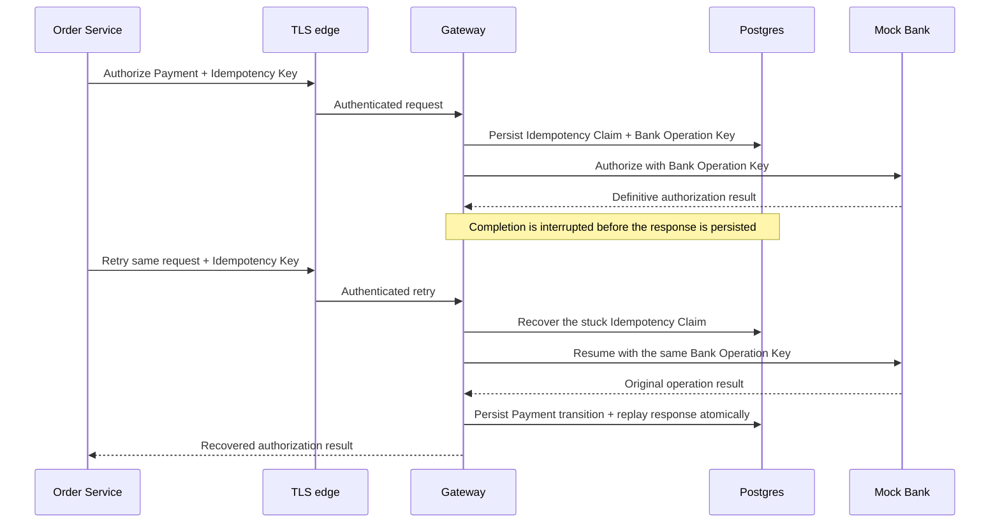
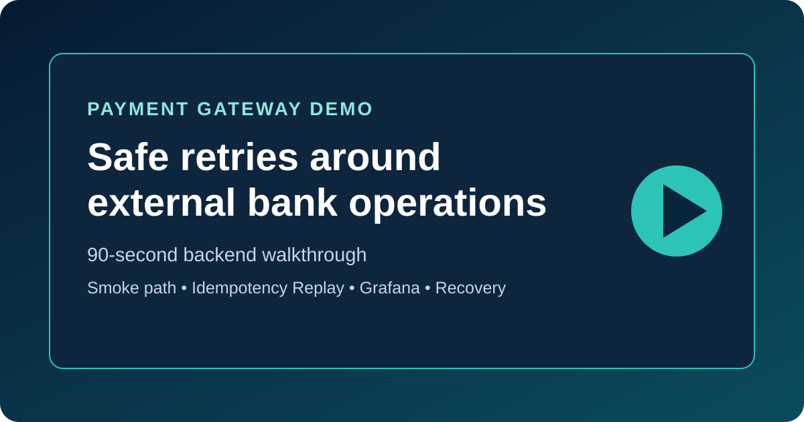

# Payment Gateway Demo

[](https://github.com/roigada/payment-gateway/actions/workflows/quality-gates.yml)


This repository is a portfolio demo of a payment gateway between an e-commerce Order Service and a Mock Bank. The **gateway service in [`gateway/`](gateway/) is authored project work**: it owns Payment records, retry safety, recovery, and the translation between public Payment IDs and bank references. [`mock-bank/`](mock-bank/) is **bundled third-party demo dependency infrastructure**, included so the complete system can run locally; see its [provenance](mock-bank/PROVENANCE.md).

## What this demonstrates

- **Crash-safe idempotency across an external side effect:** the gateway persists a caller's Idempotency Key and its own Bank Operation Key before asking the Mock Bank to act, so a retry can recover one operation rather than create a duplicate bank side effect.
- **Production-shaped backend boundaries:** an authenticated service-to-service HTTP API, Postgres persistence, private metrics, an opt-in TLS edge demo, and documented operational signals make the reliability story inspectable.
- **Runnable evidence:** the local Docker demo, OpenAPI contract, HTTP collection, tests, CI smoke paths, and non-root production image let a reviewer verify the claims instead of taking them on trust.

## Recovery in one request



## Short walkthrough



The planned 60–90 second unlisted YouTube walkthrough will show a smoke success, an Idempotency Replay, the Grafana dashboard, and the recovery documentation. Its [safe recording script](docs/portfolio/youtube-walkthrough-script.md) deliberately excludes credentials, headers, environment files, and card details. Link the published video from this section before creating the portfolio release.

## Reviewer path (5–10 minutes)

From a clean checkout with Docker available, follow this path in order. It takes you from a running system, through its public behavior and operational signals, to the implementation decisions behind them.

1. Start the local demo runtime:

   ```sh
   make demo
   ```

   This generates an ignored, throwaway local Service Credential in `.env`, then starts Postgres, applies gateway migrations, starts the bundled Mock Bank, runs the gateway on `http://localhost:8080`, and provisions Prometheus and Grafana. The raw credential stays only in that ignored local file.

2. In another terminal, verify the public happy path:

   ```sh
   make demo-smoke
   ```

   The smoke check waits for readiness, proves an unauthenticated Payment request is rejected, authorizes a Payment through the Mock Bank, captures it, fetches it, and verifies the final `captured` status. It also confirms the public gateway does not serve `/metrics` while Prometheus scrapes the private operational listener.

3. Explore the API yourself with the runnable [`demo/payment-gateway.http`](demo/payment-gateway.http) collection. It includes health, readiness, authenticated authorization, an Idempotency Replay, capture, fetch, search, and a declined payment. The formal endpoint and schema reference is the gateway [OpenAPI contract](gateway/docs/api/openapi.yaml).

4. Inspect the traffic in [Grafana](http://localhost:3000) (`admin` / `payment-gateway`). The provisioned Gateway Overview dashboard refreshes every five seconds; run the smoke command again if it has no traffic yet.

5. Inspect the same gateway-owned signals in [Prometheus](http://localhost:9090): check the scrape target, then query the HTTP, payment-operation, Mock Bank dependency, and Postgres pool metrics. Prometheus intentionally scrapes the gateway’s private `/metrics` listener, not the bundled Mock Bank.

6. Go deeper through the [gateway README](gateway/README.md), [architecture decisions](gateway/docs/adr/), [domain language](gateway/CONTEXT.md), and [alert runbook](gateway/docs/runbooks/gateway-alerts.md).

## Evidence behind the walkthrough

The demo above is the short route. This map links each production-shaped backend claim to the implementation, validation, or operational evidence behind it, without requiring a reviewer to reconstruct the story from issue history.

- **Crash-safe retries:** a same-key retry can recover a [Stuck Idempotency Claim](gateway/docs/adr/0022-use-claimed-at-for-stuck-idempotency-claims.md) with its original Bank Operation Key; the [application recovery tests](gateway/internal/app/payment_service_test.go) and [Postgres claim tests](gateway/internal/postgres/payment_store_test.go) cover the persistence and recovery seams. The bounded [`payment_gateway_idempotency_recovery_total`](gateway/README.md#operational-endpoints) metric makes recovery outcomes inspectable in the running gateway.
- **Visible quality and contract gates:** [GitHub Actions quality gates](.github/workflows/quality-gates.yml) run the gateway test suite, [validate the OpenAPI contract](gateway/docs/api/openapi.yaml), exercise the root [Compose smoke path](demo/smoke.sh), and build and smoke-test the production image. The same checks are available locally through `make test`, `make validate-openapi`, `make demo-smoke`, and `make image-smoke`.
- **Deployable artifact:** the [gateway Dockerfile](gateway/Dockerfile) packages only the authored Go service and migrations; the [release workflow](.github/workflows/release-image.yml) publishes versioned `ghcr.io/roigada/payment-gateway` images on releases and version tags.
- **Operations and Pending visibility:** [Prometheus alert rules](observability/prometheus/rules/gateway-alerts.yml) link to the [gateway alert runbook](gateway/docs/runbooks/gateway-alerts.md), including the Aging Pending Payment signal and its client-driven Authorization Retry procedure. The alerting boundary stays gateway-owned: it uses outbound Mock Bank metrics and does not scrape Mock Bank internals.

## What the gateway demonstrates

- **Safe client retries:** callers supply an **Idempotency Key** for every mutating command. Repeating the same key and request replays the original result; reusing it with different values returns `409 Conflict` rather than creating another payment operation.
- **No duplicate bank side effects:** the gateway persists a separate **Bank Operation Key** before calling the Mock Bank. A gateway retry can therefore ask the bank to resume one operation instead of capture, void, refund, or authorize twice.
- **Durable recovery:** Postgres persists the Payment command claim and recovery facts before the bank call, then persists the Payment transition and replay response atomically after a definitive result. That keeps recoverable failures from becoming silent or duplicate side effects.
- **Operational visibility:** Prometheus metrics expose HTTP, payment-command, Mock Bank dependency, and Postgres pool behavior with bounded labels; Grafana makes the signal inspectable in the local demo. The [runbook](gateway/docs/runbooks/gateway-alerts.md) explains the currently provisioned alert symptoms and queries.

## Local runtime reference

Useful endpoints after `make demo`:

```text
Gateway health:       http://localhost:8080/healthz
Gateway readiness:    http://localhost:8080/readyz
Gateway metrics:      private to Compose; scrape through Prometheus (not localhost:8080/metrics)
Gateway API contract: gateway/docs/api/openapi.yaml
Grafana:              http://localhost:3000
Prometheus:           http://localhost:9090
Mock Bank docs:       http://localhost:8787/docs
Mock Bank health:     http://localhost:8787/health
```

If default host ports are already in use:

```sh
GRAFANA_PORT=3001 PROMETHEUS_PORT=9091 MOCK_BANK_PORT=8788 make demo
```

Stop or reset the local runtime with:

```sh
make demo-down
make demo-reset
```

Set `MOCK_BANK_BASE_URL=http://127.0.0.1:8787` when running `make demo-smoke` if you also want the smoke check to assert Mock Bank health.

`make demo` and `make demo-smoke` generate `.env` on first use with a fresh local fingerprint secret, Service Credential verification key, configured digest, and raw Order Service credential. `.env` is ignored and must never be committed or copied into examples. Delete `.env` before the next `make demo` to rotate this throwaway credential. In a deployed environment, keep raw credentials only in the Order Service secret store, overlap active credential digests during planned rotation, and revoke a credential through a configuration rollout that removes its digest. Non-local deployments must terminate TLS before traffic reaches the gateway; local Compose is the explicit HTTP-only exception.

### Opt-in TLS edge demo

The default demo is intentionally HTTP-only. To put Caddy in front of the same gateway, dependencies, and monitoring topology, run the opt-in overlay:

```sh
make demo-tls
```

Caddy is then the only public gateway edge. It redirects `http://localhost:8080` to `https://localhost:8443` with `308`, and proxies the public API, `/healthz`, and `/readyz`. The gateway application listener has no host-published port in this mode; its private metrics listener remains reachable only to Prometheus on the Compose network. Caddy returns `404` for `/metrics` and never proxies it.

The gateway's `HTTP_MAX_REQUEST_BODY_BYTES` and HTTP timeouts remain the policy source. The TLS edge mirrors the demo's 64 KiB body ceiling and gives each gateway HTTP timeout one additional second, so it does not time out a request the gateway can still complete. A body larger than 64 KiB receives `413` from Caddy before it reaches the gateway. If the gateway is configured with a lower limit, a body within Caddy's ceiling but above that gateway limit reaches the gateway and receives its `413`; keep the two body limits aligned when changing the demo configuration. These are local reviewer-demo safeguards, not a claim about a production certificate or network policy.

Caddy creates its development CA and certificates in Docker-managed named volumes (`caddy-data` and `caddy-config`). Nothing is committed and the demo does not install trust into the host system. This is reviewer-demo certificate handling only: in a non-local deployment, the platform/edge owner is responsible for certificate issuance, renewal, trust, and network enforcement while the gateway remains private behind that edge. Run this in a second terminal to validate the certificate chain, redirect, public endpoints, absent gateway host port, and private Prometheus scrape without disabling certificate verification:

```sh
make demo-tls-smoke
```

The smoke command copies only Caddy's public local root certificate into a temporary file for `curl`, then removes it when finished. Stop or reset the overlay with `make demo-tls-down` or `make demo-tls-reset`.

## Development checks

```sh
make test
make validate-openapi
make observability-check
```

## Production image

The gateway production image is built from [`gateway/Dockerfile`](gateway/Dockerfile). It contains the compiled gateway binary and migration SQL files, runs as a non-root user, and does not apply migrations at startup.

Build it locally and verify it against an isolated Compose stack with:

```sh
make image-smoke
```

This uses a dedicated Compose project, fresh database volumes, and ports `18080` (gateway) and `18787` (Mock Bank), so it does not reuse the root demo's state. Release tags publish versioned images to `ghcr.io/roigada/payment-gateway`.

## Roadmap boundaries

This is a backend portfolio roadmap, not a hosted product. The following are intentionally out of scope: hosted deployment; a browser frontend or storefront; CORS for direct browser callers; real payment providers; background Pending Payment retry; distributed tracing; and log aggregation. Pending resolution remains client-driven through Authorization Retry so the gateway does not need to retain raw card details or CVV. Notification routing is also outside this roadmap.

## Repository map

```text
gateway/        Authored gateway implementation, domain glossary, ADRs, migrations, and service docs
mock-bank/      Bundled third-party Mock Bank demo infrastructure
demo/           Demo smoke check and manually runnable HTTP requests
observability/  Local Prometheus and Grafana demo configuration
```
